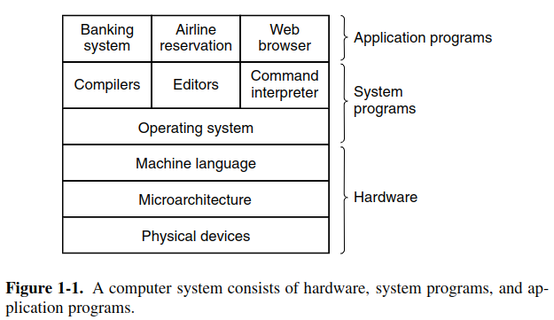

- [08/11/2022 - Conceitos Básicos](#08112022---conceitos-básicos)
- [10/11/2022 - Conceitos Básicos](#10112022---conceitos-básicos)

---
# 08/11/2022 - Conceitos Básicos

- Definição de Sistemas Operacionais
  - Alto Nível: interface para programas de usuários;
  - Baixo Nível: abstração do hardware, controle de recursos;
- Monoprogramação vs Multiprogramação
  - Único processo por vez;
  - Mais de um processo por vez;
- SO é um software intermediário entre hardware e programas de usuários;
  - Evolução: monoprogramação, mutliprogramação; monolíticos, cliente-servidor;
- Kernel e Shell;
- Chamadas de sistemas por programas de usuários para acessar o hardware;
- Recursos compartilhados vs dedicados;
  - Para os compartilhados, precisamos realizar chamadas de sistema ao OS que deve escolher se é possível ou não o uso do recurso;
- Processo: de forma simplificada, um programa em execução;
  - Na prática, todo processo é composto por vários estados (execução é um deles);
  - Todo processo contém uma série de informações adicionadas durante sua criação;
  - Dessa forma, podemos definir um processo como um *programa carregado na memória*;
  - Um processo por ter mais de uma *thread*;

# 10/11/2022 - Conceitos Básicos

[1] Modern operating system, Tanenbaum (2016)
[2] Operating Systems: Design and Implementation, Tanenbaum et. al. (2006).pdf

> *Computer software can be divided roughly into two kinds: **system programs**, which manage the operation of the computer itself, and **application programs**, which perform the actual work the user wants.* [2]

Um sistema operacional é um programa, um *software*, de sistema fundamental, sendo responsável por controlar todos os recursos do *hardware* (bottom-up) e por permitir o desenvolvimento de *programas de usuários* (i.e., uma máquina estendida; top-down).

> *If every programmer had to be concerned with how disk drives work, and with all the dozens of things that could go wrong when reading a disk block, it is unlikely that many programs could be written at all.* [2]

- **Hardware**
  - *Dispositivos Físicos*: circuitos integrados, cabos, fonte, etc.
  - *Microarquitetura*: unidades funcionais, caminho de dados. Em algumas máquinas, as unidades funcionais são controlados por um software chamado de *microprogram*. Em outros casos, o controle é realizado diretamente pelos circuitos.
  - *Linguagem de Máquina*: Instruction Set Architecture (ISA) + Hardware.
- **Software**
  - *Programas de Sistema*: SO (kernel mode), Compiladores (user mode), Interpretadores de Comando (Shell), GUI, etc.
  - *Programas de Usuário*

> O **sistema operacional** é executado em **kernel (supervisor) mode**. Nesse modo, o controle sobre o hardware é total e toda instrução da ISA pode ser executada livremente. 

> *That said, in many systems there are programs that run in user mode but which help the operating system or perform privileged functions.* [2]

> *To summarize it in a nutshell, the operating system provides a variety of services that programs can obtain using special instructions called system calls.* [2]

Evolução dos sistemas operacionais em paralelo com as gerações dos computadores:

- 1ª Geração (1945-55): Vacuum Tubes and Plugboards
  - *These machines were enormous, filling up entire rooms with tens of thousands of vacuum tubes, but they were still millions of times slower than even the cheapest personal computers available today.*
  - *In these early days, a single group of people designed, built, programmed, operated, and maintained each machine. All programming was done in absolute machine language, often by wiring up plugboards to control the machine’s basic functions.*
- 2ª Geração (1955-65): Transistors and Batch Systems
  - *For the first time, there was a clear separation between designers, builders, operators, programmers, and maintenance personnel.*
  - *These machines, now called mainframes, were locked away in specially air-conditioned computer rooms, with staffs of specially-trained professional operators to run them.*
  - **Job** (programa ou conjunto de programas) --> Escrever o "código"  (FORTRAN, Assembly) --> Converter para cartões perfurados --> Esperar para iniciar execução --> Executar --> Remover a saída.
  - *Batch system*: pegar vários *jobs*, realizar a leitura em uma máquina mais simples e salvar em um armazenamento externo, colocar os *jobs* na máquina de processamento, obter as saídas, colocar para impressão.
  - *Typical operating systems were FMS (the Fortran Monitor System) and IBSYS, IBM’s operating system for the 7094.*
- 3ª Geração (1965-1980): ICs and Multiprogramming 
  - *The greatest strength of the ‘‘one family’’ idea was simultaneously its greatest weakness. The intention was that all software, including the operating system, OS/360, had to work on all models. It had to run on small systems, which often just replaced 1401s for copying cards to tape, and on very large systems, which often replaced 7094s for doing weather forecasting and other heavy computing. It had to be good on systems with few peripherals and on systems with many peripherals. It had to work in commercial environments and in scientific environments. Above all, it had to be efficient for all of these different uses.*
  - Algumas técnicas começaram a ser utilizadas nesse geração: *multiprogramming* (CPU ociosa enquanto outros trabalhos poderiam ser executados), *spooling* (quando um job terminar, outro pode ser colocado em sua partição), *timesharing* (variação de multiprogramming onde cada usuário possui um terminal).
- 4ª Geração (1980-Atualmente): Personal Computers
- 5ª Geração (1990-Atualmente): Mobile Computers

> *The interface between the operating system and the user programs is defined by the set of "extended instructions" that the operating system provides. These extended instructions have been traditionally known as system calls, although they can be implemented in several ways.*
> 
> *The MINIX 3 system calls fall roughly in two broad categories: those dealing with processes and those dealing with the file system.*

- **Processo**: Em resumo, um processo é um programa em execução. 
  - Todo processo possui um *espaço de endereçamento*, definindo quais locais de memória principal podem ser acessados (leitura/escrita).
  - Esse espaço contém os dados do programa, o executável do programa e o seu *stack*.
  - *Also associated with each process is some set of registers, including the program counter, stack pointer, and other hardware registers, and all the other information needed to run the program.*
  - *When a process is suspended temporarily [...] it must later be restarted in exactly the same state it had when it was stopped. This means that all information about the process must be explicitly saved somewhere during the suspension.*
    - Em muitos sistemas operacionais, todas informações dos processos (salvo o conteúdo de seu espaço de endereçamento) são armazenadas numa *tabela de processos* (array de estruturas, cada uma representando um processo existente na máquina).
  - Dessa forma, um *processo suspenso* consiste de seu espaço endereçável (*core image*) e sua entrada na tabela de processos.
  - *The key process management system calls are those dealing with the **creation** and **termination** of processes.*
    - Por exemplo, um *shell* (*command interpreter*) lê comandos escritos pelo usuário e deve executá-lo através da criação de um novo processo. Ao final da sua execução, esse processo deve se auto-terminar.
  - Quando possuímos uma árvore de processos (e.g., processos filhos que criam novos processos), normalmente precisamos de alguma *comunicação entre processos* para coordenar suas atividades.
  - Um *sinal de alarme* é uma forma do SO suspender temporariamente as atividades principais de um processo para que ele responda a algum acontecimento. 
    - *Signals are the software analog of hardware interrupts.*
  - **UID**: User IDentification. Todo processo possui o UID do usuário que o inicializou (processos filhos compartilham desse mesmo UID).
  - **GID**: Group IDentification.
  - **Superuser**: usuário com "poderes" especiais que permite violar regras de proteção, normalmente utilizado por administradores de sistemas.
  - **Espaço de Endereçamento**: 
    - *More sophisticated operating systems allow multiple programs to be in memory at the same time. To  keep them from interfering with one another (and with the operating system), some kind of protection mechanism is needed. While this mechanism has to be in the hardware, it is controlled by the operating system.*
    - *The  address  space  is  decoupled  from  the  machine’s physical  memory and may be either larger or smaller than the physical memory. Management of address  spaces  and  physical  memory  form  an  important  part  of  what  an  operating system does.*
  - **Arquivos** (*Files*): 
    - *As noted before, a major function of the operating system is to hide the peculiarities of the disks and other I/O devices and present the programmer with a nice, clean abstract model of device-independent files.*
    - *System calls are obviously needed to create files, remove files, read files, and write files. Before a file can be read, it must be opened, and after it has been read it should be closed, so calls are provided to do these things.*
    - Um diretório é uma forma de agrupar arquivos e outros diretórios. Esse modelo gera um hierarquia chamada de *sistema de arquivos* (*file system*).
    - Todo arquivo na hierarquia de diretórios pode ser especificado através de um *caminho* originado no diretório *raiz*.
    - Entretanto, em todo momento cada processo possui um *working directory* (*diretório de trabalhos*), nos quais caminhos que não se iniciam na raiz são buscados.
    - No MINIX 3, arquivos e diretórios são protegidos através de um código binário com 11 bits.
      - *The protection code consists of three 3-bit fields: one for the owner, one for other members of the owner’s group (users are divided into groups by the system administrator), one for everyone else, and 2 bits [...]*
      - O conjunto de 3 bits é comumente referido por **rwx** (**r**ead, **w**rite, e**x**ecute).
    - *Before a file can be read or written, it must be opened, at which time the permissions are checked. If access is permitted, the system returns a small integer called a file descriptor to use in subsequent operations. If the access is prohibited, an error code (−1) is returned.*
    - *Mounted file systems* permitem que dispositivos de memória externos possam ser anexados ao *file system* da raiz através de um *mount point*.
    - *Special files* são arquivos especiais que fazem com que dispositivos I/O se comportem como arquivos. Assim, eles podem ser lidos e escritos com as mesmas chamadas de sistemas para arquivos.
    - Um *pipe* é um pseudo-arquivo que permite conectar dois processos. O *pipe* funciona como um arquivo de saída para um dos processos e como um arquivo de entrada para outro.

> *Now that we have seen what operating systems look like on the outside (i.e, the programmer’s interface), it is time to take a look inside. [...] The five designs are monolithic systems, layered systems, virtual machines, exokernels, and client-server systems.*

- **Monolithic Systems**: "A grande bagunça". Não existe uma estrutura pré-definida e o SO é implementado como uma coleção de procedimentos que podem ser invocados em qualquer lugar.
  - *When this technique is used, each procedure in the system has a well-defined interface in terms of parameters and results, and each one is free to call any other one, if the latter provides some useful computation that the former needs.*
  - *Even in monolithic systems, however, it is possible to have at least a little structure. The services (system calls) provided by the operating system are requested by putting the parameters in well-defined places, such as in registers or on the stack, and then executing a special trap instruction known as a kernel call or supervisor call.*
- **Layered Systems**

